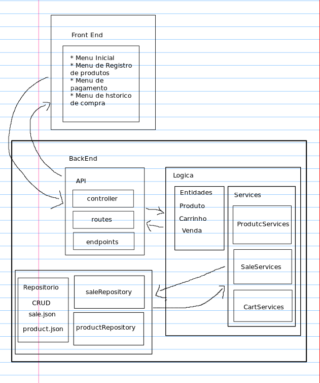
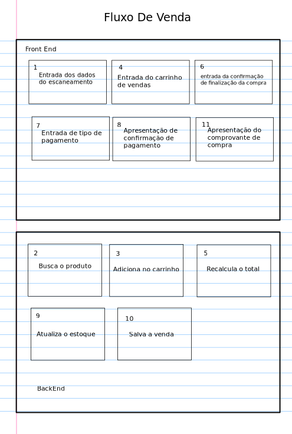
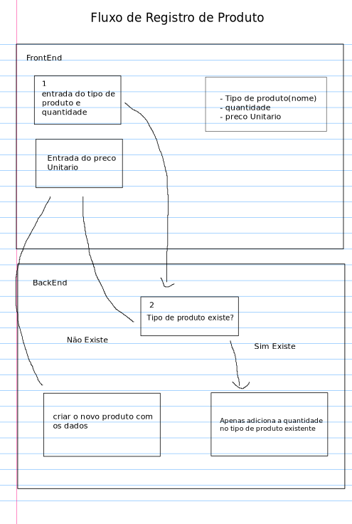
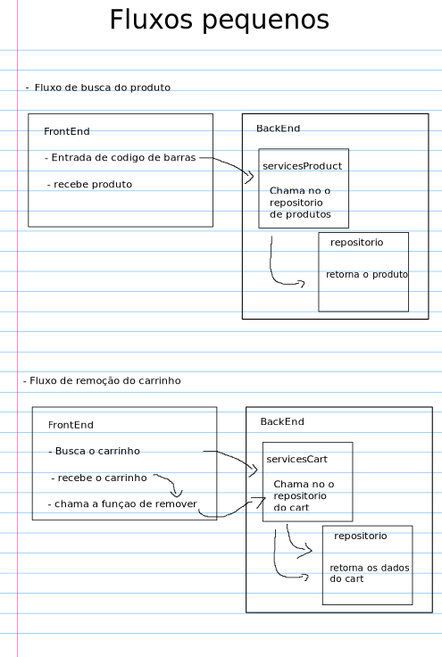

# MarketFlow

## O que é?

O **MarketFlow** é um sistema de gerenciamento de vendas inspirado no funcionamento de caixas de supermercado.
Ele simula o fluxo completo de uma compra, desde o registro de produtos no sistema até a finalização de uma venda.

O projeto foi desenvolvido com foco em **aprendizado de arquitetura backend, lógica de programação e organização de sistemas**, representando como aplicações reais lidam com controle de estoque, carrinho de compras e registro de vendas.

---

## Pra que serve?

O sistema tem como objetivo simular o funcionamento básico de um **ponto de venda (POS)** de supermercado, permitindo:

* Registrar produtos no sistema
* Controlar quantidade em estoque
* Buscar produtos pelo código de barras
* Adicionar ou remover produtos de um carrinho de compra
* Calcular o valor total da compra
* Finalizar vendas
* Registrar o histórico de compras realizadas

Além disso, o projeto também serve como **estudo prático de desenvolvimento backend**, ajudando a compreender:

* separação de responsabilidades
* organização de camadas de uma aplicação
* fluxo de dados entre frontend e backend
* estrutura de APIs
* manipulação de dados e regras de negócio

---

## Ferramentas:

O projeto utiliza tecnologias voltadas para o desenvolvimento backend e organização de aplicações.

* **Node.js** – ambiente de execução JavaScript no servidor
* **TypeScript** – tipagem estática para maior segurança no código
* **JSON** – armazenamento inicial de dados (simulando um banco de dados)
* **Git** – controle de versão do projeto
* **GitHub** – hospedagem do repositório

---

## Funcionalidades:

O sistema possui funcionalidades que representam o fluxo de um sistema de vendas.

### Cadastro de Produtos

* Registrar novos produtos
* Definir nome, preço e quantidade em estoque
* Atualizar quantidade de produtos existentes

### Busca de Produtos

* Buscar produtos pelo código de barras ou ID
* Retornar informações como nome, preço e estoque disponível

### Carrinho de Compras

* Adicionar produtos ao carrinho
* Remover produtos do carrinho
* Atualizar quantidades
* Calcular automaticamente o valor total da compra

### Processamento de Venda

* Confirmar compra
* Escolher tipo de pagamento
* Finalizar venda

### Controle de Estoque

* Atualizar automaticamente a quantidade de produtos após uma venda

### Histórico de Vendas

* Registrar cada venda realizada
* Permitir consulta de compras anteriores

---

## Objetivo do Projeto

O **MarketFlow** é um projeto de estudo focado em:

* arquitetura backend
* lógica de programação
* estruturação de APIs
* simulação de sistemas reais de mercado

Ele foi projetado para evoluir com o tempo, podendo futuramente incluir:

* banco de dados real
* autenticação de usuários
* relatórios de vendas
* dashboard administrativo
* integração completa com frontend.

-----

# Estrutura do projeto

# Fluxo de Vendas

# Fluxo de Registro de produto

# Fluxo de funções menores

